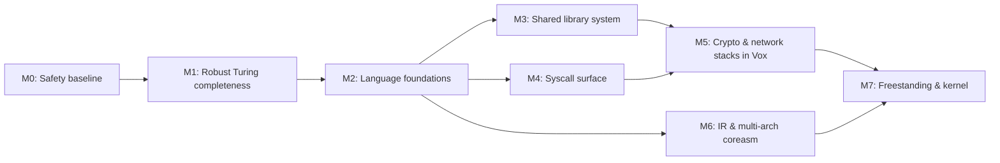

# Vox Roadmap: From Today to a Kernel Written in Vox

This roadmap charts the path from the current state of Vox (v0.4.15) to the
long-term goal: a memory-safe, sentence-based systems language capable of
expressing *any* program, including cryptographic libraries, network stacks,
device drivers, and ultimately an operating system kernel, across multiple
target architectures.

Guiding principles, in priority order:

1. **Memory safety is non-negotiable.** Every new low-level capability must
   enter the language through a declared, bounds-checked, or explicitly fenced
   construct, never through silent undefined behavior.
2. **Turing completeness must be robust, not theoretical.** The computational
   core (loops, recursion, unbounded memory) must be stress-tested and
   guaranteed, not just demonstrated.
3. **Libraries before features.** Once the syscall surface and shared library
   system exist, capabilities like crypto and networking are written *in Vox*
   as libraries, not baked into the compiler.
4. **Port the runtime, not the programs.** Architecture support means
   rewriting `coreasm/` per target behind a stable interface, so user programs
   and libraries compile unchanged.



---

## Milestone 0: Correctness & Memory-Safety Baseline

*The safety claims in README.md must be true before anything is built on them.*

- [x] **Fix the `_list_append` reallocation segfault.** *(Fixed. The
      `.need_realloc` path in `coreasm/x86_64/list.asm` now grows correctly;
      verified 2026-07-31 at 5 000 and 10 000 appends. The original report:
      an empty list was created with capacity 8 and the 9th append crashed
      with SIGSEGV.)*
- [x] Add regression tests to `tests/` for list growth across the realloc
      boundary (9, 100, 100 000 elements) and for dynamic buffer growth.
      *(`tests/209_list_growth_realloc_boundary.vox` brackets the 9th-append
      grow path and reads back first and last element at each size, so a
      realloc that loses or misaligns copied data fails rather than merely
      counting correctly. `tests/210_buffer_growth.vox` covers dynamic growth
      and the fixed-buffer refusal.)*
- [x] Reconcile documented vs. actual dynamic-buffer semantics. *(Resolved by
      documenting the real behavior, the second of the two options: a
      fixed-size buffer does not grow, and `set byte N` past the end is a
      no-op that sets the error flag; only dynamic buffers grow, and only on
      append. README's "Memory Safety Model" now says so.)*
- [ ] Stress-test every core abstraction (lists, buffers, strings, files)
      well past its initial capacity; add these to `test.sh`.
- [ ] Adopt the compile-time safety goals in
      [docs/segfault-safety-test-plan.md](docs/segfault-safety-test-plan.md):
      no valid Vox program may segfault at runtime.
- [x] **Fix the compiler-tracked-type-vs-runtime-type divergence family.**
      *(Fixed in v0.3.3. A variable's type is now fixed at its declaration
      and locked for good: a type-differing write is a compile error, not a
      silent retype. This closed 18 confirmed findings across the class,
      documented in `docs/plans/294_retype_audit.md`; see LANGUAGE.md's "Type
      Immutability" section for the user-facing rule. Two things this does
      NOT close, tracked as their own follow-ups in the same audit: casting a
      dynamically-tagged `value` still can't convert (finding 21, currently
      a compile error instead of a silent wrong answer, which is the safe
      state, but the conversion itself isn't implemented), and a `.lib`'s
      declared signature is trusted, not verified against its `.so` (audit
      section C).)*

**Exit criteria:** the full test suite passes; no known program written in
documented Vox can crash the generated binary.

---

## Milestone 1: Robust Turing Completeness

*Vox is already computationally universal on paper (verified: recursion,
`while` loops, dynamic buffers growing without bound). This milestone makes
that guarantee load-bearing.*

- [ ] Guarantee unbounded memory: dynamic buffers and lists must grow until
      `mmap` fails, and allocation failure must set the error flag (or exit
      cleanly), never corrupt memory.
- [ ] Guarantee deep recursion: document stack behavior, detect/handle stack
      exhaustion predictably.
- [ ] **Acceptance test: a Brainfuck interpreter written in pure Vox** (a
      `while` loop + dynamic buffer as tape). If Vox can run it, Turing
      completeness is demonstrated end-to-end, not just claimed.
- [ ] Acceptance test: a program that computes with values and memory sizes
      chosen at runtime (no compile-time bounds anywhere).
- [ ] Document the computational core in LANGUAGE.md: what is guaranteed,
      what sets error flags, what the limits are.

**Exit criteria:** the Brainfuck interpreter passes a standard test program;
stress tests run at 10⁶+ iterations and 10⁸+ bytes without faults.

---

## Milestone 2: Language Foundations for Systems Code

*The building blocks that crypto, networking, and drivers all require.
Design doc: [docs/STRUCTS_AND_OBJECTS.md](docs/STRUCTS_AND_OBJECTS.md).*

- [x] **Structs / user-defined types**: SHIPPED in 0.4.0 as **things**
      (see LANGUAGE.md §6 and `docs/plans/310_user_defined_structures.md`):
      compile-time layout, the possessive `'s` accessor, unlimited
      nesting, value copy semantics, manifest function members, and
      cross-file definitions. Adversarially tested. Still open from the
      original item: *exact byte layout control* (field widths, ordering,
      padding) for packet headers, device registers, and on-disk formats;
      today every field is an 8-byte slot, so the IPv4-header exit
      criterion below remains gated on sized integers.
- [ ] **Sized integers**: 8/16/32/64-bit reads and writes, signed and
      unsigned, with explicit width in the syntax (today everything is a
      64-bit `number`). Wrapping/overflow semantics defined, not accidental.
- [ ] **Function references / indirect calls**: required later for interrupt
      vector tables, driver operation tables, and callback-style library APIs.
- [ ] Typed multi-byte buffer access (`word N of buf`, `dword N of buf`),
      bounds-checked like byte access, with explicit endianness.
- [ ] Richer numerics per README roadmap item 6 (float completeness, division
      semantics, bit rotation).
- [ ] **Decouple compute from I/O in the runtime.** Audit finding: several
      `coreasm/x86_64` routines currently do both in one place, e.g.
      `float.asm` (lines ~178, 222, 230, 291) and `format.asm` convert a
      number to text *and* call `sys_write` inline, in the same routine.
      Split every such routine into a pure "value → bytes in a buffer" step
      and a separate "write buffer to fd" step, so `io.asm` is the *only*
      module that ever emits a raw `sys_write`. This is good hygiene on its
      own and is a hard prerequisite for M7 (a freestanding fork can't cleanly
      swap the I/O backend if formatting logic is welded to it).

**Exit criteria:** a Vox program can define an IPv4 header as a struct,
populate it field-by-field into a buffer, and read it back, all
bounds-checked.

---

## Milestone 3: Dynamic / Shared Library System

*Design doc: [docs/SHARED_LIBRARIES_DESIGN.md](docs/SHARED_LIBRARIES_DESIGN.md).
The producer side works today: `--shared` emits a versioned `.lib` and `.so`,
multi-input builds support several `Library <name> version "x.y"` blocks in
one binary, and symbols are mangled with `<lib>_<ver>_<func>`. The consumer
side is also wired: `see '<lib>' version "<ver>" from "<path>.lib"` selects
the matching `<lib, version>` block, resolves the `Location` `.so`, verifies
every promised symbol against the `.so`'s `.dynsym`, and places the `.so` on
the link line. Test coverage includes single-version consumers, two versions
of one library consumed from the same `.lib`, and explicit diagnostics for
missing `.lib`, absent library, version mismatch, missing `.so`, stale ToC,
wrong arity, and wrong type.*

- [ ] Harden `--shared` builds: symbol scoping (library-private vs. exported
      functions), no symbol collisions between libraries.
- [x] Versioning enforcement: `see "math" version "1.0"` fails clearly at
      compile time on version mismatch.
- [ ] Define a compatibility policy (major = breaking, minor = additive), so
      a library's minor-version bump does not force dependents to recompile.
- [ ] Define and document a **stable Vox ABI**: calling convention, buffer
      and list memory layout, error-flag propagation across library
      boundaries. Struct layout (M2) becomes part of the ABI.
- [ ] Cross-library resource tracking: files/buffers allocated inside a
      library are cleaned up by the same exit-time guarantees.
- [ ] Ship a first-party `std` seed library (string ops, parsing, math) as
      the proving ground for the toolchain.

**Exit criteria:** two independently compiled libraries and a main program
link and run together; upgrading a library's minor version requires no
recompile of dependents.

---

## Milestone 4: Syscall Surface

*Design doc: [docs/SYSCALLS_BRAINSTORM.md](docs/SYSCALLS_BRAINSTORM.md).
Baseline was mmap, read, write, open, close, exit, clock_gettime.*

### Delivered: filesystem & process syscalls (PR #81, `feature/initramfs-syscalls`)

Nine new syscalls landed with dedicated grammar, codegen, and tests (82
passing, 4 skipped as root/namespace-only manual tests):
`mkdir`(83), `chdir`(80), `access`(21), `symlink`(88), `rmdir`, `mknod`(133),
`mount`(165), `pivot_root`(155), `execve`(59). Full plan in
[docs/initramfs-implementation-plan.md](docs/initramfs-implementation-plan.md);
end-to-end demonstration in
[examples/initramfs.vox](examples/initramfs.vox): a real early-userspace
init sequence (mount `/proc`/`/sys`/`/dev`, create device nodes, wait for the
root device, mount it, `pivot_root`, `chdir`, `execve` into `/sbin/init`).
`pivot_root` was verified end-to-end inside an isolated mount namespace
(`unshare --mount`), confirmed via a marker file only visible post-switch,
not just a zero return code.

### Delivered: post-#81 hardening and system-control syscalls

Follow-up work on the same branch:
- **`unmount`/`umount`** (umount2, 166), with `lazily` (MNT_DETACH). Syncs
  nothing; the initramfs example now uses `unmount "/oldroot" lazily` to
  release the old root after `pivot_root`, and `put_old` is created before
  the switch (both were latent bugs: pivot_root would have failed ENOENT).
- **`shutdown`/`poweroff`, `reboot`/`restart`, `halt`** (reboot, 169): each
  `sync`s then issues the matching `LINUX_REBOOT_CMD_*`. Non-root failure
  sets the error flag instead of aborting, so `On error` works and an
  accidental run never powers off. This is the piece an init needs to
  handle its own shutdown path.
- **`execute` argument flexibility**: a bare `execute "/bin/sh".` synthesizes
  `argv = [path, NULL]`; a **list variable** (not just a literal) is now
  accepted, with argv built at runtime by `_list_to_argv`; the array is
  sized and the copy bounded from a single read of the list length, so it
  cannot be overrun regardless of contents.
- Whole-system demonstration on real hardware: an all-Vox two-stage chain
  (`mkdir` → `mount /dev/sda2` → write a program onto the partition →
  `execute` the compiler to build-and-run it from there → `unmount` →
  `rmdir`) runs in ~0.5s.

**Important scope note:** this is a **hosted-Linux** achievement, not a step
toward M7. Every one of these syscalls requires a kernel already booted and
servicing `syscall`; it means Vox can now write the *first userspace program*
a Linux kernel execs (an initramfs `/init`, replacing what's usually a shell
script), not that Vox is any closer to being that kernel. Keep this distinct
from the freestanding work in M7.

**Design-choice lesson learned, feeding back into this milestone's remaining
work:** each of these 9 syscalls got its own hand-written grammar (`Create a
directory called ...`, `Mount ... at ... with type ...`, `Execute ... with
arguments [...]`) and its own parser + AST + codegen path, roughly 1,500
lines changed across `parser/mod.rs`, `parser/ast.rs`, `codegen/mod.rs`, and
`coreasm/x86_64/file.asm` for 9 syscalls. That reads beautifully, but doesn't
scale linearly to the ~20+ syscalls a network stack needs
(socket/bind/listen/accept/connect/send/recv/setsockopt/poll/epoll/...) or to
crypto's need for things like `getrandom`. This is concrete evidence for why
the generic primitive below still matters; it shouldn't cost a feature
branch and a parser change per syscall, and it's the right form for
lower-traffic, protocol-shaped syscalls where dedicated natural-language
grammar would read awkwardly anyway (e.g. `setsockopt`).

### Still to do

- [ ] **Generic syscall primitive** so new OS facilities become *library*
      work, not compiler work. Sentence-shaped, explicit, and marked as the
      low-level tier, e.g.:
      ```
      perform system call 41 with 2 and 1 and 0 into sockfd.
      On error print "socket creation failed".
      ```
      Buffer arguments pass base+length pairs so bounds information survives
      the boundary. Reserve dedicated grammar (the pattern PR #81 used) for
      syscalls common enough to earn readable sentences; route the long tail
      through this primitive.
- [ ] Safe wrappers in the seed library for the high-value remaining
      syscalls: sockets (socket/bind/listen/accept/connect/send/recv),
      polling (epoll/poll), fork/wait, pipes, signals, prioritized per the
      brainstorm doc.
- [ ] Error-flag integration: negative syscall returns set the Vox error
      flag and preserve errno for inspection; extend the pattern already
      established by the mount/pivot_root/execve error paths.

**Exit criteria:** a TCP echo server written in pure Vox (no compiler
changes), using only the syscall primitive plus library wrappers.

---

## Milestone 5: Crypto & Network Stacks as Vox Libraries

*The proving ground: real, hostile-input systems code written in the safe
subset of the language. Abstractions get layered on top of these later.*

- [ ] `vox-crypto`: SHA-256, HMAC, ChaCha20 (or AES), Poly1305, pure Vox,
      operating on buffers with sized-integer ops from M2.
  - [ ] Constant-time discipline: document which language constructs are
        safe for secret-dependent code; add a roadmap note for
        secret-independent branching guarantees.
  - [ ] Validate against official test vectors (NIST/RFC) in `tests/`.
- [ ] `vox-net`: sockets layer (M4 wrappers) → DNS resolver → HTTP/1.0
      client and server (README roadmap item 3).
- [ ] Fuzz both libraries with malformed input; bounds-checked buffers
      should make memory corruption impossible: prove it.
- [ ] Build one real tool on top (e.g. a static-file HTTP server with TLS
      out of scope, or a checksum utility) and dogfood it.

**Exit criteria:** crypto passes official test vectors; the HTTP server
survives a fuzzing run and serves real traffic.

---

## Milestone 6: IR & Multi-Architecture coreasm

*Design docs: [docs/IR_DESIGN.md](docs/IR_DESIGN.md),
[docs/MULI_ARCH_PLAN.md](docs/MULI_ARCH_PLAN.md). The `--target` flag and
`coreasm/{aarch64,Win64}/` stubs exist; x86_64 has 14 runtime modules, the
others have 3.*

- [ ] Introduce the IR between analyzer and codegen (per IR_DESIGN.md), so
      optimizations and lowering are portable: "optimize the IR, not the
      assembly."
- [ ] Define the **coreasm contract**: the fixed set of runtime routines
      (heap, list, buffer, string, io, file, format, time, resource...) with
      documented register/ABI expectations per architecture, so a port is
      "implement this checklist," not reverse-engineering.
- [ ] **AArch64 (ARM64) port**: first non-x86 target; full coreasm rewrite
      plus IR lowering; run the whole `tests/` suite under qemu or native.
- [ ] **RISC-V (rv64) port**: second port; proves the contract generalizes.
- [ ] Win64 port (PE output, Windows syscall/API strategy): tracked but
      lowest priority of the three.
- [ ] CI runs the full test suite per architecture (qemu-user is sufficient).
- [ ] **The grid as a math kernel** *(design: [docs/plans/321_grid_math_kernel.md](docs/plans/321_grid_math_kernel.md))*.
      A chained loop expansion (`'f' of each i from ... and each j from ...`,
      shipped 0.4.5, plan 320) desugars to a **perfect affine loop nest**,
      explicit iteration space, affine bounds, order fixed by clause order,
      body a single pure call. That is exactly the shape vectorizers and
      polyhedral optimizers want, and it is stated as grammar rather than
      reverse-engineered from pointer loops. But today's codegen wraps each
      element in ~30 instructions of ceremony (a real `call`, prologue,
      `_check_call_depth`/`_dec_call_depth`, stack-spilled params,
      push/pop expression evaluation, a duplicated `_last_error` clear)
      around as little as two of real work: scalar, and roughly 50–200×
      off an FMA kernel for matmul-shaped work. On the IR, in payoff order:
      (a) **inline small callees at grid sites**: the desugar already owns
      the call, so this deletes the call/prologue/depth-checks/spills in one
      stroke, the single biggest win; (b) **registerize induction variables**
      (row/col in registers, not `inc qword [rbp-24]`); (c) **vectorize the
      innermost clause**: the rightmost clause is known-innermost by the
      language rule, so its lanes map to SIMD over `float` buffers as the
      contiguous tensor substrate, the entry point to real vector calculus;
      (d) **cache tiling for free**: a blocked kernel is just more clauses
      (`each iblock ... and each jblock ... and each i ... and each j`),
      expressible today with no new syntax. IR-gated: do it once, portably,
      not per-arch. Prereq for any serious numerical Vox (M5 crypto included).

---

## Milestone 7: Freestanding Vox & the Kernel Path

*Everything above assumes a Linux userspace underneath. Concretely: `syscall`
with no kernel present raises `#UD` (EFER.SCE is never set), there is no IDT
to catch it, and the fault cascades into a triple fault. `_start` also
assumes the Linux ELF loader's stack layout (argc/argv/envp), which a
bootloader never provides. This milestone removes the Linux-hosted assumption
without giving up the safety model; it does **not** mean "no interaction
with hardware," it means "no dependency on a resident kernel to mediate that
interaction." Hardware access under `--freestanding` goes through declared
device regions or fenced asm instead of `syscall`.*

**A capability-tier model, not a separate grammar.** The sentence-level
syntax (`if`/`while`/functions/expressions/structs) is architecture- and
host-agnostic already and needs no changes. What changes per profile is
which *builtins* are available and what backs them:

| Tier | Capability | Hosted backend | Freestanding backend |
|---|---|---|---|
| 0 | Arithmetic, control flow, recursion, structs, sized ints | native instructions | identical; no change |
| 1 | Buffers, lists (memory) | `mmap` | static linker-reserved arena, later a Vox-authored page allocator |
| 2 | Print, write | `sys_write` | declared device region (serial/VGA); compile error if none declared |
| 2 | Files, argv, env, time | `open`/`read`, loader stack, `clock_gettime` | **compile-time error under `--freestanding`**: no filesystem, no loader, no RTC syscall exists to back these |
| 3 | Device regions, interrupts, fenced asm | n/a (doesn't exist hosted) | new, freestanding-only |

Tier 2 is intentionally split in two: I/O has a real freestanding backend
(a UART is just a device region), but files/argv/env/time do not; pretending
otherwise would be exactly the kind of silent, undocumented gap that produced
the M0 list-append bug. Vox rejecting `open a file` under `--freestanding`
with a clear compiler error is the correct outcome, not a limitation to hide.

**Audit of `coreasm/x86_64`'s 14 modules** (which ones actually execute a
`syscall` instruction today, not just mention one): this is what the fork
actually costs:

| Group | Modules | Freestanding treatment |
|---|---|---|
| Clean, Tier 0 | `funcs.asm`, `int.asm` | shared unchanged between hosted/freestanding |
| Memory-only syscalls | `heap.asm`, `list.asm`, `string.asm`, `binary.asm` | fork: swap `mmap` call for static-arena allocator (depends on the M2 compute/I/O split above) |
| I/O welded into compute | `float.asm`, `format.asm`, `io.asm` | fork *after* the M2 decoupling task; `io.asm` becomes the sole `sys_write` site, retargeted to a device region |
| Deep host-service dependency | `file.asm`, `time.asm`, `resource.asm`, `core.asm` | mostly compile-time-disabled under `--freestanding`; `core.asm`'s `_start` gets a freestanding entry convention (boot-provided pointer, not argc/argv/envp) |

- [ ] **`--freestanding` target flag**, selecting `coreasm/x86_64/freestanding/`
      over `coreasm/x86_64/hosted/` (rename current tree to `hosted/` first),
      mirroring the existing per-`--target` arch selection.
- [ ] Tier-1 fork: static-arena allocator for buffers/lists, sized at link
      time or via a kernel-provided region, no `mmap`.
- [ ] Tier-2 fork: retarget `io.asm`'s print/write to a declared device
      region; compiler rejects `file`/`args`/`environment`/`time` builtins
      under `--freestanding` with a clear diagnostic (not a silent no-op).
- [ ] Freestanding `_start`: user- or boot-convention-defined entry symbol,
      no Linux stack-layout assumption.
- [ ] Linker control: custom link scripts, section placement, load address,
      needed for boot code.
- [ ] **Declared hardware regions**: the memory-safe MMIO story:
      ```
      a device region called "uart" at 0x3F8 of 8 bytes.
      set byte 1 of uart to 'A'.
      ```
      Raw addresses enter the program *only* through explicit declarations;
      every access stays bounds-checked exactly like buffers today. Volatile
      semantics (never cached, never reordered, never elided) guaranteed for
      region access.
- [ ] **Fenced assembly blocks**: the explicit, minimal escape hatch for
      privileged instructions (`cli`/`sti`, `lgdt`/`lidt`, CR/MSR access,
      port I/O), clearly marked as outside the safety guarantee, mirroring
      Rust's `unsafe` philosophy: safe by default, auditable exceptions.
- [ ] Interrupt support: declare a function as an interrupt handler
      (compiler emits the entry/exit frame), vector table via M2 function
      references.
- [ ] **Kernel milestone A:** bare-metal "hello": boots under QEMU
      (Multiboot2 or UEFI stub), prints over serial from a Vox device region.
- [ ] **Kernel milestone B:** toy kernel: GDT/IDT setup, keyboard IRQ,
      physical page allocator feeding the freestanding buffer system.
- [ ] **Kernel milestone C:** the M5 network stack running on a Vox NIC
      driver (virtio-net under QEMU): the full vision: driver, stack, and
      abstraction layers all in Vox.

**Exit criteria:** milestone B boots and handles input under QEMU on x86_64
and at least one other M6 architecture.

---

## Sequencing Summary

| Order | Milestone | Unblocks |
|-------|-----------|----------|
| 1 | M0 Safety baseline | Everything; the guarantees must be real |
| 2 | M1 Robust Turing completeness | Confidence to build big programs |
| 3 | M2 Language foundations | M3, M4, M6 |
| 4 | M3 Shared libraries + M4 Syscalls (parallel) | M5 |
| 5 | M5 Crypto & network stacks | M7, real-world validation |
| 6 | M6 IR & multi-arch | M7 on non-x86 |
| 7 | M7 Freestanding & kernel | The end goal |

M3/M4 can proceed in parallel after M2. M6 can start any time after M2,
earlier is cheaper, since every feature added before the IR exists must be
ported by hand later.
